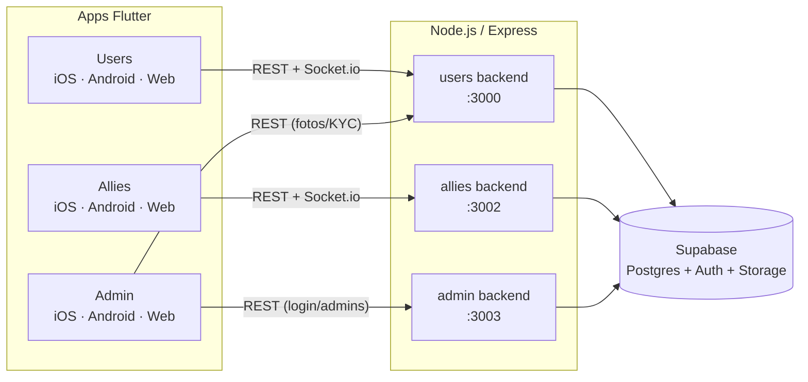

<div align="center">


# tudu

**Marketplace de servicios locales para Colombia.**
Conecta usuarios que necesitan un servicio con aliados que lo prestan — con un panel de administración que gobierna todo el ecosistema.

[](https://flutter.dev)
[](https://nodejs.org)
[](https://supabase.com)
[](https://socket.io)
[]()

</div>

---

## Qué es tudu

tudu son **tres aplicaciones que comparten una sola base de datos**, cada una con su propia app de Flutter y su propio backend de Node.js:

| | Para quién | Qué resuelve |
|---|---|---|
| **Users** | Clientes | Buscan un servicio, lo publican, lo contratan, califican al aliado |
| **Allies** | Prestadores de servicio | Se verifican con KYC, arman su perfil, atienden solicitudes en tiempo real |
| **Admin** | Equipo de tudu | Aprueba KYC, modera el catálogo de servicios, gestiona cuentas de administradores |

Los tres backends leen y escriben sobre el **mismo proyecto de Supabase (Postgres)** — no hay bases separadas ni sincronización que mantener entre ellas.

---

## Arquitectura



| App | Frontend | Backend | Puerto |
|---|---|---|---|
| Users | `tudu_users/users/` | `tudu_users/backend/` | `3000` |
| Allies | `tudu_allies/allies/` | `tudu_allies/backend/` | `3002` |
| Admin | `tudu_admin/admin/` | `tudu_admin/backend/` | `3003` |

> El Flutter del panel Admin consume el backend de **Users** (3000) para fotos y notificaciones en tiempo real; el backend Admin (3003) solo maneja login y CRUD de administradores.

---

## Stack técnico

- **Frontend:** Flutter 3.44 / Dart 3.12 — apps nativas para iOS, Android y Web desde una sola base de código
- **Backend:** Node.js + Express, 3 servicios independientes
- **Base de datos:** Supabase (Postgres 17) — schema versionado con el Supabase CLI, migrations aplicadas automáticamente en cada merge a `main` vía GitHub Integration
- **Auth:** JWT propio (access + refresh) sobre verificación OTP (correo vía Supabase Auth, SMS vía Twilio)
- **Tiempo real:** Socket.io — notificaciones de KYC y cambios de foto sin recargar
- **Storage:** Supabase Storage (buckets `avatars`, `kyc`, `portfolio`) — nada de imágenes en base64 dentro de Postgres
- **i18n:** español / inglés en la app de usuarios

---

## Seguridad

No es una demo con `origin: "*"` y ya — cada backend implementa:

- **JWT de dos tokens** — acceso corto (30 min) + refresco largo (180 días), revocable de verdad: al refrescar se comprueba que la sesión siga activa en `device_sessions`, así que cerrar sesión corta el acceso aunque el token siga siendo válido criptográficamente
- **Autorización por dueño de recurso** — un token válido de un usuario no permite operar sobre los datos de otro (excepto el rol `admin`, que gestiona cuentas por definición)
- **Rate limiting por correo** en OTP y login (no por IP — evita que redes móviles compartidas se bloqueen entre sí, y que cambiar de IP sirva para saltarse el límite)
- **Contraseñas de admin con bcrypt**, con migración automática de hashes antiguos en el primer login
- **CORS configurable por allowlist** (`CORS_ORIGINS`) en vez de comodín abierto
- **RLS activo en las 20 tablas** de Postgres — los backends operan con la service role key (la salta por diseño), pero `anon`/`authenticated` no tienen ni una fila expuesta
- **OTP por SMS real (Twilio)** además del OTP por correo de Supabase Auth
- **Modo desarrollo aislado** — el atajo de OTP maestro solo existe detrás de `DEV_MODE=true`, nunca en producción

---

## Funcionalidades

**Users**
- Registro y login sin contraseña (OTP por correo o SMS)
- Buscar, publicar y contratar servicios por categoría
- Perfil con avatar, direcciones (33 departamentos / +1000 ciudades de Colombia), tarjetas guardadas
- Historial de búsquedas, modo oscuro, español/inglés
- Solicitud de cambio de foto con aprobación de admin, notificada en tiempo real

**Allies**
- Verificación KYC (cédula + selfie) con revisión de admin
- Perfil de servicio con portafolio de trabajos (fotos)
- Bandeja de solicitudes en tiempo real, asignación y cambio de estado
- Sesión única por dispositivo

**Admin**
- Revisión de KYC (aprobar / rechazar con motivo)
- Moderación del catálogo de servicios y categorías propuestas por aliados
- Gestión de solicitudes de cambio de foto
- CRUD de administradores con roles

**Plataforma**
- 85 endpoints REST (48 Users · 29 Allies · 8 Admin) sobre 40 pantallas de Flutter
- Mantenimiento automático vía `pg_cron`: expira sesiones inactivas, limpia registros de aliados abandonados y fotos ya notificadas — corre dentro de Postgres, no depende de que un proceso de Node siga vivo

---

## Base de datos

Schema versionado con el **Supabase CLI**, no solo en el dashboard:

```
supabase/
├── migrations/     # historial completo, aplicado automático al mergear a main
├── seed.sql        # catálogo: departamentos, ciudades, países, servicios, categorías
└── config.toml
```

```bash
supabase db pull                       # traer cambios hechos en el dashboard
supabase migration new <nombre>        # nueva migration
git push origin main                   # el GitHub Integration la aplica sola
```

---

## Arrancar en local

**Requisitos:** Flutter 3.44+, Node 20+, una cuenta de Supabase con el proyecto linkeado, Xcode/Android Studio para simuladores.

```bash
git clone https://github.com/juandatiner/TuDu.git
cd TuDu

# variables de entorno — copiar y completar en cada backend
cp tudu_users/backend/.env.example tudu_users/backend/.env
cp tudu_allies/backend/.env.example tudu_allies/backend/.env
cp tudu_admin/backend/.env.example tudu_admin/backend/.env

./run-dev.sh users     # backend :3000 + Flutter Users
./run-dev.sh allies    # backend :3002 + Flutter Allies
./run-dev.sh admin     # backend :3003 + Flutter Admin
./run-dev.sh all       # los 3 backends + comandos para las 3 apps
./run-dev.sh backend   # solo los backends, sin Flutter
```

`run-dev.sh` detecta la IP local de la red y se la pasa a Flutter con `--dart-define`, así que los simuladores encuentran el backend sin tocar código al cambiar de red.

---

## Roadmap

- [ ] Mensajería in-app entre usuario y aliado
- [ ] Reviews y calificación de aliados
- [ ] Notificaciones push (FCM)
- [ ] Procesador de pagos real (hoy las tarjetas se guardan enmascaradas, sin cobrar)
- [ ] Filtros de búsqueda por ubicación

---

<div align="center">

Software propietario — todos los derechos reservados.

</div>
